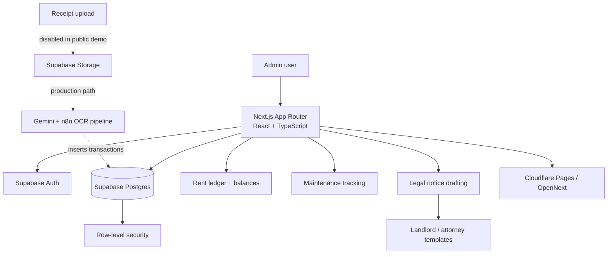
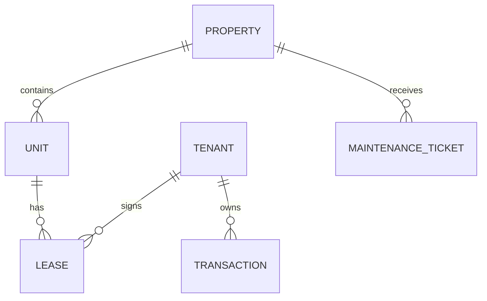

# Property OS

A single-admin property-management application for managing properties, units, tenants, leases, rent ledgers, maintenance, and attorney-review legal notices for overdue accounts.

> **Public demo scope:** This is a sanitized portfolio build based on a real production system. The public repository is de-branded and de-identified, uses fictional data, and intentionally disables the production receipt-upload automation. The public demo is intended for architecture walkthroughs and interviews, not as a claim of a continuously running production deployment.

## What I built

The application models the property-management workflow around a relational Postgres data model and a Next.js application layer. The key domain relationship is **property → unit → tenant → lease**, while rent balances are carried across lease renewals at the tenant level rather than resetting with each lease record.

## Core capabilities

- Portfolio dashboard with overdue and occupancy summaries
- Property, unit, tenant, and lease management
- Monthly per-tenant rent ledger
- Tenant-level balance continuity across lease renewals
- Maintenance ticket tracking
- Attorney-review legal-notice drafting for overdue accounts
- Notice templates selected from the property and landlord-entity context

## Architecture



The receipt-upload path is shown as a dashed production-only path because it is intentionally disabled in this public repository. The rest of the application runs from seeded sample data.

## Data model and engineering detail

The central domain model is organized as:



A key implementation choice is that rent balance continuity is partitioned by **tenant**, not by lease. That allows a renewal to continue an existing tenant balance instead of starting a separate accounting history.

Legal notices are drafts only. The notice flow supports 14, 30, and 90-day variants plus a court-ledger format, with the selected landlord-entity and attorney template derived from the tenant's property context.

## Stack

| Layer | Technology |
|---|---|
| UI | Next.js App Router, React, TypeScript |
| Styling | Tailwind CSS, shadcn/ui |
| Data / auth | Supabase Postgres + Auth |
| Authorization | PostgreSQL row-level security |
| Production OCR path | Gemini + n8n + Supabase Storage trigger |
| Deployment | Cloudflare Pages via `@opennextjs/cloudflare` |

## Public demo limitations

- **Receipt upload is disabled.** In production, scanned checks are uploaded to storage and an automation pipeline using Gemini and n8n parses them into transactions. That live backend integration is not part of this public demo.
- The public environment uses fictional, seeded sample data.
- Legal notices are drafts for attorney review, not automatic legal actions.

## Local development

```bash
npm install
npm run dev
```

The application requires a Supabase project with the app schema applied.

Copy `.env.example` to `.env.local` and provide the values for your Supabase project.

## Build and Cloudflare preview

```bash
npm run build
npm run preview
```

The repository also includes Cloudflare deployment scripts:

```bash
npm run deploy
npm run upload
```

These commands use OpenNext for Cloudflare. They require your own Cloudflare and Supabase configuration.

## Repository orientation

```text
app/                 Next.js routes and UI
components/          Shared UI components
lib/                 Supabase and domain helpers
public/               Static assets
supabase/             Database schema / SQL artifacts where applicable
.env.example          Local configuration template
next.config.ts        Next.js configuration
open-next.config.ts   Cloudflare OpenNext configuration
```

The exact tree can evolve with the application; the README intentionally highlights the main areas a reviewer is likely to inspect first.

## Portfolio notes

This repository is strongest as a **product engineering** example: a business domain implemented as a working web application with relational state, authentication, row-level security, workflow-specific UI, and a clearly separated public-demo boundary around the production OCR automation.
